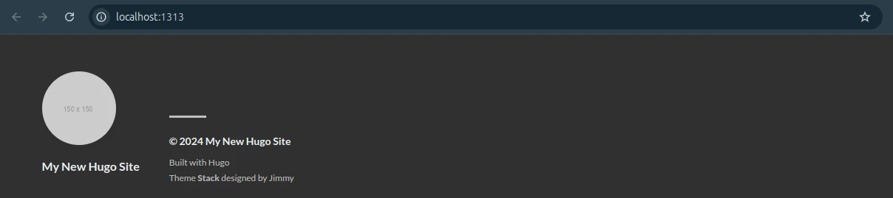
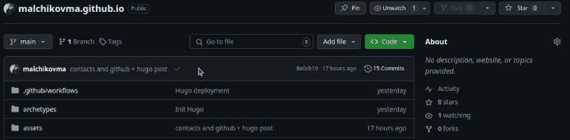

+++
title = 'Как хостить сайт на GitHub с Hugo'
date = 2024-10-18T16:33:17+03:00
draft = true
image = 'hugo-logo.webp'
tags = ['Админитрирование', 'Руководства']
+++

## Введение

GitHub позволяет использовать репозиторий как статический веб-сайт. Существует генератор статических сайтов Hugo. Так почему бы не подружить эти инструменты?

> GitHub из коробки работает с Jekyll, но я уже потратил вечер на изучание Hugo, и он мне понравился.

Для этого нам понадобится знание Git, Markdown и YAML. А при работе с репозиторием по ssh, еще и умение работать с ключами шифрования на базовом уровне.

Описываю свой опыт, так что все упоминания malchikovma осознанно заменяем на свои собственные. Все происходит на Ubuntu Linux, но на Mac и Windows процесс должен быть примерно таким же.

## Создаем сайт на github.io

Для начала создадим простой сайт из репозитория. GitHub выпустил красивую инструкцию на эту тему ([pages.github.com](https://pages.github.com/)). Я следовал ей, но встретил несколько проблем. Как их решить, описываю далее.

Создаем репозиторий в GitHub с именем `malchikovma.github.io`.

Копируем его локально:

```sh
git clone git@github.com:malchikovma/malchikovma.github.io.git malchikovma.ru
```

Название директории я выбрал "malchikovma.ru" по названию своего домена. Можно указать любое другое: site, blog, etc.

Если возникла проблема с доступом, можно настроить ssh-ключ и указать его в настройках GitHub. Есть официальная инструкция, но на данный момент она не переведена на русский язык: ["Создание нового ключа SSH и его добавление в ssh-agent"](https://docs.github.com/ru/authentication/connecting-to-github-with-ssh/generating-a-new-ssh-key-and-adding-it-to-the-ssh-agent?platform=linux). Кратко опишу процесс:

1. Выполняем команду `ssh-keygen -t ed25519 -C "malchikovma@gmail.com"`. В процессе указываем название файла: `github_personal_ed25519`. Пароль можно не указывать.
В результате в директории `~/.ssh` получим два файла: `github_personal_ed25519` и `github_personal_ed25519.pub`.
1. Выполняем команду `ssh-add ~/.ssh/github_personal_ed25519`. В дальнейшем это позволит не указывать файл ключа вручную.
1. Добавляем содержимое файла `github_personal_ed25519.pub` в настройки профиля GitHub: Settings, SSH and GPG keys, New SSH key.

После этого проблема с доступами должна исчезнуть. Альтернативно, можно использовать протокол https, но тогда GitHub будет спрашивать каждый раз логин и пароль. Подробнее: [Сведения об удаленных репозиториях](https://docs.github.com/ru/get-started/getting-started-with-git/about-remote-repositories).

```sh
git clone https://github.com/malchikovma/malchikovma.github.io.git malchikovma.ru
```

Переходим в свеже созданную директорию, открываем ~~Vim~~ свой любимый редактор и создаем файл `index.html` с содержимым "Hello GitHub Pages!".

Публикуем изменения, и в течение минуты наше приветствие будет доступно по адресу [malchikovma.github.io](https://malchikovma.github.io).

```sh
git add .
git commit -m 'Initial commit'
git push -u origin main
```

При коммите Git может запросить ваши данные. Указываем их:

```sh
git config user.email 'malchikovma@gmail.com'
git config user.name 'Mikhail Malchikov'
```
Если все получилось, идем дальше.

## Настройка Hugo

### Установка

Устанавливаем Hugo. На Ubuntu Linux это делается командой `sudo apt install hugo`. Для других систем смотрим официальное руководство: [Hugo - Installation](https://gohugo.io/installation/).

Hugo не может создать новый сайт в уже существующей директории, поэтому создаем его рядом, задем перемещаем в созданный ранее репозиторий.

```sh
hugo new site malchikovma.ru.bak
cp malchikovma.ru.bak/* malchikovma.ru/
```

> Официальное руководство [Hugo - Quick Start](https://gohugo.io/getting-started/quick-start/) несколько отличается от нашего процесса. В частности тем, что там не учитывается интеграция с GitHub.

Hugo использует [систему модулей git](https://git-scm.com/book/ru/v2/%D0%98%D0%BD%D1%81%D1%82%D1%80%D1%83%D0%BC%D0%B5%D0%BD%D1%82%D1%8B-Git-%D0%9F%D0%BE%D0%B4%D0%BC%D0%BE%D0%B4%D1%83%D0%BB%D0%B8). Устанавливаем ~~первую приглянувшуюся~~ тему [Stack](https://themes.gohugo.io/themes/hugo-theme-stack/) и указываем в конфиге, что используем ее:

```sh
git submodule add https://github.com/CaiJimmy/hugo-theme-stack.git themes/stack
echo "theme = 'stack'" >> hugo.toml
```

Запускаем локальный сервер: `hugo server --buildDrafts`. Сайт будет доступен по адресу [http://localhost:1313/](http://localhost:1313/). Он нужен для локальной разработки: посмотреть, как выглядит страница перед публикацией. Hugo использует hot reload, при изменении файлов они автоматически перезагружаются в браузере. Иногда это не помогает и нужно ~~пнуть~~ перезапустить сервер Hugo.

На данном этапе мы должны получить рабочий сайт без контента.



### Пишем первый пост

Чтобы создать первый пост, используем команду `hugo new content content/post/my-first-post.md`. Она создаст файл по указанному пути. Можно создать его и вручную, но команда имеет преимущество: она создаст так называемый [front matter](https://gohugo.io/content-management/front-matter/): метаданные о публикации в формате TOML. Front matter этой статьи:

```md
+++
title = 'Как хостить сайт на GitHub с Hugo'
date = 2024-10-18T16:33:17+03:00
draft = false
image = 'hugo-logo.webp'
+++

Текст статьи...
```

Открываем файл в ~~Vim~~ [^1] своем любимом редакторе. Пишем текст в формате Markdown. При сохранении, изменения должны отразиться на сайте.

[^1]: Это скорее шутка, так как Vim известен своей недружелюбностью. Этот пост я пишу в [Gnome Text Editor](https://apps.gnome.org/ru/TextEditor/).


На этом знакомство с Hugo окончено. Как дальше можно изменить внешний вид сайта пишет автор нашей темы: [stack.jimmycai.com](https://stack.jimmycai.com/).

Одно последнее напутствие: [конвертируем формат конфигурации из TOML в YAML](https://transform.tools/toml-to-yaml). TOML - прекрасный формат, но плохо подходит для вложенных структур, таких как меню и виджеты. Соответственно, меняем расширение файла с `.toml` на `.yaml`. Hugo сам поймет, что формат изменился.

### Публикация на GitHub

Теперь, при отправке изменений в GitHub, мы не увидим наш прекрасный новый сайт. Дело в том, что GitHub по умолчанию берет содержимое корневой директории, а Hugo публикует результат в директорию public.

Как вариант, в [конфигурации Hugo](https://gohugo.io/getting-started/configuration/#publishdir) можно указать, чтоб сайт создавался в директории docs: `publishdir: docs`. В настройках репозитория GitHub также указываем, публиковать директорию docs.

Можно использовать репозиторий в таком виде, а можно генерировать сайт на стороне GitHub через Actions.

## GitHub Actions

При детальном рассмотрении, видим, что GitHub использует пайплайн сборки Jekyll для нашего сайта. Даже если мы этого не хотим. Зачем разворачивать образ операционной системы и устанавливать кучу программ, просто чтоб загрузить куда-то HTML файлы? Звучит как полный оверинжиниринг. Но что поделать: используем или дефолтный, или свой.

Сообщество Hugo предоставляет нам [готовый скрипт по сборке сайта в GitHub Pages](https://gohugo.io/hosting-and-deployment/hosting-on-github/). Директории `public` и `resources/_gen` теперь можно не отслеживать и добавить в .gitignore, они нам не понадобятся для публикации. 

Создаем файл `.github/workflows/hugo.yaml` и копируем в него содержимое:

```yaml
# Sample workflow for building and deploying a Hugo site to GitHub Pages
name: Deploy Hugo site to Pages

on:
  # Runs on pushes targeting the default branch
  push:
    branches:
      - main

  # Allows you to run this workflow manually from the Actions tab
  workflow_dispatch:

# Sets permissions of the GITHUB_TOKEN to allow deployment to GitHub Pages
permissions:
  contents: read
  pages: write
  id-token: write

# Allow only one concurrent deployment, skipping runs queued between the run in-progress and latest queued.
# However, do NOT cancel in-progress runs as we want to allow these production deployments to complete.
concurrency:
  group: "pages"
  cancel-in-progress: false

# Default to bash
defaults:
  run:
    shell: bash

jobs:
  # Build job
  build:
    runs-on: ubuntu-latest
    env:
      HUGO_VERSION: 0.134.2
    steps:
      - name: Install Hugo CLI
        run: |
          wget -O ${{ runner.temp }}/hugo.deb https://github.com/gohugoio/hugo/releases/download/v${HUGO_VERSION}/hugo_extended_${HUGO_VERSION}_linux-amd64.deb \
          && sudo dpkg -i ${{ runner.temp }}/hugo.deb          
      - name: Install Dart Sass
        run: sudo snap install dart-sass
      - name: Checkout
        uses: actions/checkout@v4
        with:
          submodules: recursive
          fetch-depth: 0
      - name: Setup Pages
        id: pages
        uses: actions/configure-pages@v5
      - name: Install Node.js dependencies
        run: "[[ -f package-lock.json || -f npm-shrinkwrap.json ]] && npm ci || true"
      - name: Build with Hugo
        env:
          HUGO_CACHEDIR: ${{ runner.temp }}/hugo_cache
          HUGO_ENVIRONMENT: production
          TZ: America/Los_Angeles
        run: |
          hugo \
            --gc \
            --minify \
            --baseURL "${{ steps.pages.outputs.base_url }}/"          
      - name: Upload artifact
        uses: actions/upload-pages-artifact@v3
        with:
          path: ./public

  # Deployment job
  deploy:
    environment:
      name: github-pages
      url: ${{ steps.deployment.outputs.page_url }}
    runs-on: ubuntu-latest
    needs: build
    steps:
      - name: Deploy to GitHub Pages
        id: deployment
        uses: actions/deploy-pages@v4
```

> Зачем тратить минуту на установку зависимостей при каждой публикации? Можно загрузить уже готовые файлы за секунду. Я попытался удалить шаги сборки из пайплайна и генерировать сайт локально, но тщетно.

В настройках репозитория Pages указываем: использовать для сборки не бранч, а Action. Теперь при пуше в Github, он сам будет создавать директорию public и отправлять ее в сервис Pages.



## Свой домен

GitHub бесплатно предоставляет нам свой субдомен с именем пользователя: [malchikovma.github.io](malchikovma.github.io). Но что, если мы хотим иметь свой, да еще и с сертификатом? У нас есть такая возможность. Для этого нужно приобрести желаемый домен (я это сделал на рег.ру). В панели управления, в разделе "DNS-серверы и управление зоной" указываем следующие значения:

|Тип записи|Префикс|Значение             |
|----------|-------|---------------------|
|A         |@      |185.199.108.153      |
|A         |@      |185.199.109.153      |
|A         |@      |185.199.110.153      |
|A         |@      |185.199.111.153      |
|CNAME     |www    |malchikovma.github.io|

Это - [IP-адресы GitHub Pages](https://docs.github.com/en/pages/configuring-a-custom-domain-for-your-github-pages-site/managing-a-custom-domain-for-your-github-pages-site#dns-records-for-your-custom-domain). Предполагаю, что 4 адреса требуются для распределения нагрузки по 4 серверам, а www-запись нужна для получения сертификата Let's Encrypt [^2]. "@" означает сам наш домен (malchikovma.ru), а www - его субдомен (www.malchikovma.ru).

[^2]: Подобную систему мы использовали в для пользовательских доменов в собственном конструкторе сайтов.

После этого, на странице настроек Pages, в разделе "Custom domain" указываем наш домен. После проверки DNS, можно указать "Enforce HTTPS". Теперь наш сайт доступен по адресу [malchikovma.ru](https://malchikovma.ru).

## Заключение

У меня давно было желание создать свой сайт, но всегда отталкивали цены на хостинг, постоянные проблемы с CMS ~~и отсутствие идей~~. С SSG и GitHub Pages звезды сошлись.

В статическом контенте масса преимуществ. HTML-страницы открываются мгновенно, практически не требуют серверных мощностей. Появляется возможность кэшировть ответы без лишних усилий. Нет необходимости настраивать и поддерживать CSM, базу данных, PHP, веб-сервер. Файлы занимают минимум места на диске: только сами статьи и материалы к ним. Можно использовать бесплатные хостинги, такие как GitHub Pages. Использование своего домена позволяет "переехать" на другой хостинг в любой момент.

Но негативные моменты тоже есть: мы лишаемся динамического контента, а порог входа слишком велик. Для человека, не занимающегося разработкой ПО, генератор статических сайтов вряд ли подойдет. Слишком многое нужно изучить: Bash, Git, YAML, Markdown. Гораздо проще взять пресловутый WordPress и работать через графический интерфейс. Но если так получилось, что у вас уже есть такой "багаж" знаний, то почему бы не воспользоваться им.
