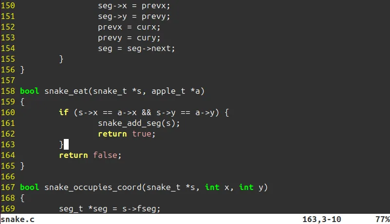
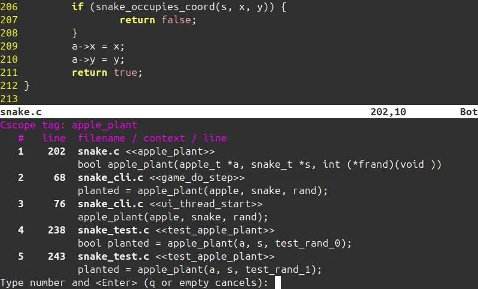
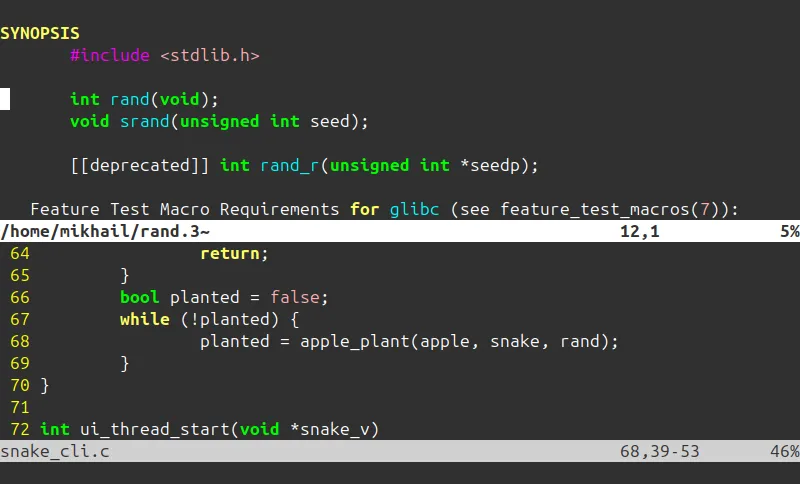

+++
title = 'Linux как IDE'
date = 2024-10-24T18:43:57+03:00
draft = true
+++

Недавно наткнулся на серию статей [Unix as IDE](https://blog.sanctum.geek.nz/series/unix-as-ide/). Название заинтриговало. На тот момент я около года как полностью переехал на Ubuntu Linux и мир Unix был для меня загадкой. Я уже давно был знаком с основными командами Bash, но не хватало глубины. Так сказать, настоящего пуристского опыта. Как писали программы наши деды? Не конкретно мои, а программисты пару-тройку поколений назад. Тогда не было удобных IDE от JetBrains. Первый шаг уже сделан - терминал под рукой. Давайте же установим великий и ужасный Vim и погрузимся в глубины прошлого.

> Стоит сделать оговорку, что Linux -- IDE, но преимущественно для языка Си. Все инструменты в нем заточены под Си. В документации часто можно услышать, что они "достаточно гибки, чтобы работать со множеством других языков", но для этого требуется значительные знания конфигурации. С Си же все работает "из коробки".

## Vim и модальное редактирование

О нем ходят легенды. Оставь надежду всяк сюда входящий. Первое, что делают при встрече с ним, гуглят, как из него выйти. То же самое случилось и со мной, когда я впервые открыл его по неосторожности (или из любопытства). Закрыл (с известным трудом) и поклялся больше не открывать. Однако он - главный герой сегодняшней статьи.

Vim так резко отпугивает по сравнению со своими консольными товарищами (mcedit, nano) тем, что он основан на так называемом модальном редактировании. Модальный тут от слова mode, то есть режим. Vim имеет несколько режимов: нормальный, выделение, редактирование, командный.

Зайдя впервые в Vim, включен нормальный режим. В нем мы можем только перемещать курсор и переходить в другие режимы. Это главное, что отпугивает новичков. В других редакторах мы привыкли сразу редактировать текст. Тут же у нас отбирают кислород и начинается паника. Понажимав несколько кнопок, происходит что-то непонятное и от греха подальше мы стремимся выйти из проклятой программы. Нажимаем несколько раз <kbd>Esc</kbd>, затем <kbd>:q!</kbd>, и мы свободны.

В другой раз мы заходим более осознанно, читаем что нам говорит приветственное окно. Переходим на страницу помощи <kbd>:help<kbd>, узнаем, что есть целый туториал, программа `vimtutor`. Запускаем ее и спустя неделю-другую боли, перерождаемся.

Не буду расписывать здесь все тонкости работы с Vim, тем более, что я их не знаю. Люди десятилетиями работают с ним и все еще открывают для себя новые особенности. Скажу только, что Vim настолько крут, что вышел за пределы Vim. Для всех популярных и не очень редакторов есть возможность использовать комбинации клавиш Vim. И они существуют не зря. Vim это навык. Однажды научившись ему, мы продолжаем идти с ним по жизни. Мы можем переходит от редактора к редактору, у каждого из них свои особенности. Но использование Vim остается на уровне мышечной памяти. Хотя для написания этой статьи я его не использую, так как требуется слишком часто переключать языковые раскладки. Существуют решения для этого и может быть я однажды до них доберусь.

> Существует старый мем про противостояние Vim и Emacs. Какой из редакторов круче? Кто-то сказал, что это редакторы из мира, которого уже не существует. Но интересно попробовать оба и понять, что они все еще с нами. Способ вызова команд Emacs, зажимая комбинацию клавиш, используют все современные редакторы. А плагины для модального режима vim существуют под многие редакторы. Плагин для IDE JetBrains IdeaVim скачали больше 16 миллионов раз, это говорит о его популярности.

Получив в свое распоряжение всю мощь Vim, давайте попробуем написать простенькую программу на Си и узнать, что нам может предложить этот допотопный мир.

## Программирование

Я написал примитивный вариант "Змейки" на Си, можно посмотреть его на GitHub: https://github.com/malchikovma/csnake.

Первое, что мы хотим от IDE это подстветка синтаксиса. В Vim с этим полный порядок. В наше время подсветка синтаксиса не является чем-то необычным, так что не будем на нем останавливаться. (Давно ли редактировали HTML страницы в notepad.exe)

Затем, мы хотим получать подсказки по мере печати. Для меня было удивительно, но они здесь есть. Нажимаем <kbd>Ctrl</kbd> + <kbd>n</kbd> и получаем подсказки по всем словам из текущего файла. Но я хочу подсказки для всех функций проекта и стандартной библиотеки. Для этого нам понадобится отдельная программа `ctags` https://ctags.io/. Установим ее. Ба! Да это же прямо как с плагинами в IDE. Linux - наш IDE, а программы это плагины к нему. Выполняем команду `ctags -R` в корне проекта. Программа строит базу данных в виде текстого файла `tags`. Vim умеет работать с ним. Теперь автоподстановка работает как надо и делает это буквально мгновенно. Мне так не хватает этой скорости даже в сравнительно быстром VS Code.

Далее, я хочу быстро перемещаться по проекту, прыгать к "определению" функции или переменной и обратно. Ctags уже об этом позаботился. Наводим курсов на символ, нажимает <kbd>Ctrl</kbd> + <kbd>}</kbd> и вот мы на месте. <kbd>Ctrl</kbd>+<kbd>t</kbd>, чтобы вернуться обратно.

Но что, если я хочу найти все места, где используется функция? Тут полномочия `ctags` заканчиваются, зато начинаются у `cscope` https://cscope.sourceforge.net/cscope_vim_tutorial.html. Устанавливаем, пишем конфиги. Строим базу тэгов аналогично `ctags`: `cscope -R`. Наводим курсор на функцию и нажимаем <kbd>Ctrl</kbd> + <kbd>\</kbd>, <kbd>s</kbd>. Необычная комбинация. В результате видим все места, где вызывается функция и можем к ним перейти.

Еще я хочу знать, с какими параметрами вызывать функцию. Подсказки на лету нам не доступны, но мы всегда можем перейти к определению через систему тэгов. Такой подход работает для функций, исходный код которых лежит в директории проекта. Но как быть со стандартной библиотекой? Для нее доступны только весьма запутанные файлы заголовков. На помощь приходит команда man. ...разделы man.

