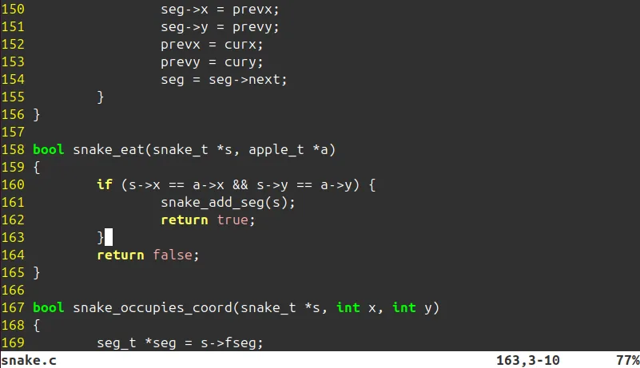
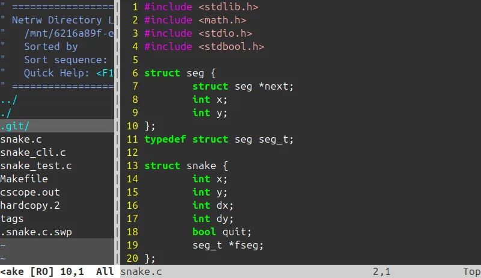
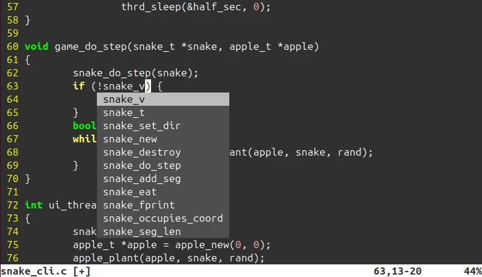
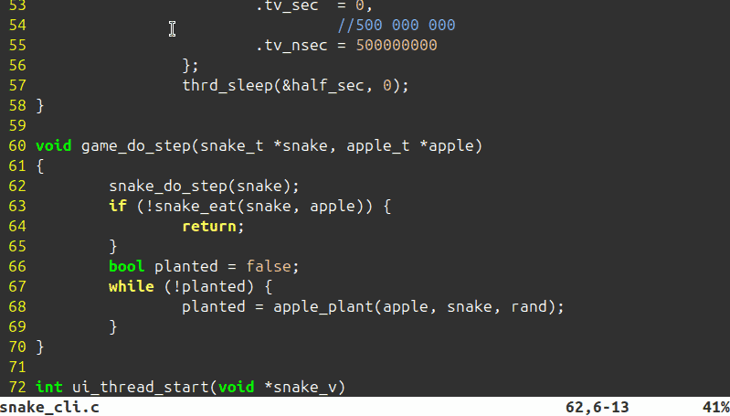
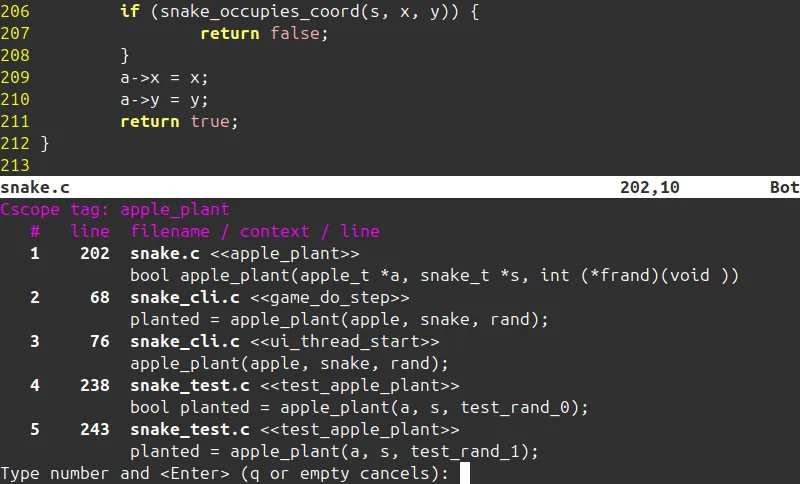
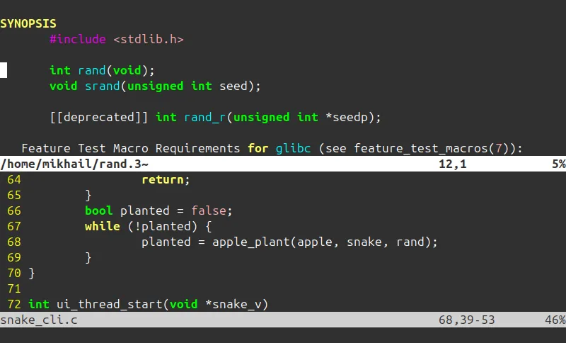
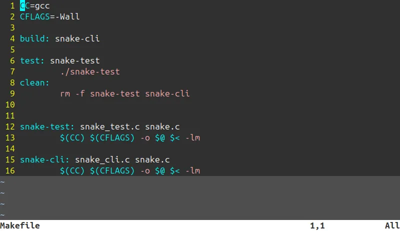
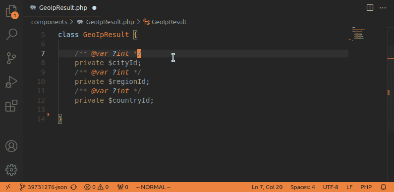

Недавно наткнулся на серию статей [Unix as IDE](https://blog.sanctum.geek.nz/series/unix-as-ide/). Название заинтриговало. На тот момент я полностью переехал на Ubuntu Linux (снова), но редко выходил за пределы своего уютного PHPStorm. Путь Unix оставался для меня загадкой.

Я уже был знаком с командами Bash, прочитал пару книг по теме, но не хватало глубины. Так сказать, настоящего гонзо-опыта. Как писали программы наши деды? Не конкретно мои, а программисты пару-тройку поколений назад. Тогда не было удобных IDE от JetBrains. На слуху был великий и ужасный редактор Vim. Поговаривали, что он обладал возможностями изменять саму ткань пространства и времени. Давайте же установим его и приобщимся к тайному знанию.

> Стоит сделать оговорку, что Linux и Vim можно считать IDE, но преимущественно для языка Си. Все инструменты в них заточены под Си. В документации часто можно услышать, что они "достаточно гибки, чтобы работать со множеством других языков", но для этого требуется значительные знания конфигурации. С Си же все работает "из коробки".

## Модальное редактирование

Оставь надежду всяк сюда входящий. Первое, что делают при встрече с Vim, это гуглят, как из него выйти. То же самое случилось и со мной. Впервые открыв его по неосторожности (или из любопытства), тут же закрыл (с известным трудом) и поклялся больше не возвращаться.

Vim так резко отпугивает по сравнению со своими консольными товарищами (mcedit, nano) тем, что он основан на так называемом модальном редактировании. Модальный тут от слова mode, то есть режим. Vim имеет несколько режимов: нормальный, выделение, редактирование, командный.

Зайдя впервые в Vim, включен нормальный режим. В нем мы можем только перемещать курсор и переходить в другие режимы. Это главное, что отпугивает новичков. В других редакторах мы привыкли сразу редактировать текст. Тут же у нас отбирают кислород, начинается паника. Понажимав несколько кнопок, происходит что-то непонятное и от греха подальше мы стремимся выйти из проклятой программы. Нажимаем несколько раз <kbd>Esc</kbd>, затем вводим `:q!`, и мы свободны.

В другой раз мы заходим более осознанно. Читаем, что нам говорит приветственное окно. Переходим на страницу помощи `:help`, узнаем, что есть целый туториал, программа `vimtutor`. Запускаем ее и спустя неделю-другую боли, перерождаемся.

Не буду расписывать здесь все тонкости работы с Vim (тем более, что я их не знаю). Люди десятилетиями работают с ним и все еще открывают для себя новые особенности. Скажу только, что Vim настолько крут, что вышел за пределы Vim. Для всех популярных и не очень редакторов есть возможность использовать комбинации клавиш Vim. И они существуют не зря. Vim это навык. Однажды научившись ему, мы продолжаем идти с ним по жизни. Мы можем переходит от редактора к редактору, у каждого из них свои особенности. Но использование Vim остается на уровне мышечной памяти. 

> Существует старый мем про противостояние Vim и Emacs. Какой из редакторов круче? Кто-то сказал, что они оба из мира, которого больше не существует. Но интересно попробовать оба и понять, что они все еще с нами. Способ вызова команд Emacs, зажимая комбинацию клавиш, используют все современные редакторы. А плагины для модального режима Vim существуют повсеместно. Плагин для IDE JetBrains IdeaVim скачали больше 16 миллионов раз, это говорит о его популярности.

Получив в свое распоряжение всю мощь ~~грейскала~~ модального редактирования, давайте попробуем написать простенькую программу на Си и узнать, что нам может предложить этот "допотопный" редактор.

## Функционал

Я написал примитивный вариант "Змейки" на Си, можно посмотреть его на GitHub: [malchikovma/csnake](https://github.com/malchikovma/csnake). Этот проект будет нашим подопытным ~~змеем~~ кроликом.

Первое, что мы хотим от любого редактора, это подсветка синтаксиса. В Vim с этим полный порядок. В наше время подсветка синтаксиса не является чем-то необычным, так что не будем на нем останавливаться. (Давно ли редактировали HTML страницы в notepad.exe)

Далее, про каждую особенность подробно.

### Файловый менеджер

Давайте посмотрим, какие файлы есть в проекте. В этом нам поможет замечательная команда `:Sex`, что означает "Split&explore", или ее менее интересный родственник `:Lex`. Vim имеет встроенный файловый менеджер, netrw. Он обладает широким, но глубоко неизведанным функционалом. Его мануал занимает более 50 страниц A4 мелким шрифтом. Наверняка он умеет многое. Проверять я конечно же это не буду.

На самом деле я редко им пользуюсь. Как правило, проекты на Си представляют собой кучу файлов в одном каталоге. Можно посмотреть на репозиторий самого [Git на GitHub](https://github.com/git/git). Все основные файлы лежат в корне проекта.

### Автоподстановка

Чем отличается IDE от обычного редактора? Он помогает писать код. И первое, чем он может помочь, это разгрузить нашу голову. По мере печати нужно подсказывать: как пишется функция, название которой мы начали печатать. 

Удивительно, но здесь есть эта функция. Нажимаем <kbd>Ctrl</kbd> + <kbd>n</kbd> и получаем подсказки по всем словам из текущего файла.

Но этого мало, нам нужны подсказки для всех функций проекта и стандартной библиотеки. Для этого понадобится отдельная программа [ctags](https://ctags.io/). Установим ее.

> Ситуация напоминает плагины в IDE. И действительно, Linux - наша IDE, а программы это плагины к нему.

Выполняем команду `ctags -R` в корне проекта. Программа строит базу данных в виде текстого файла `tags`. Vim умеет работать с ним. Теперь автоподстановка работает как надо и делает это буквально мгновенно. Такой скорости позавидует даже сравнительно быстрый VS Code.

### Перемещение по проекту

Далее, мы хотим быстро перемещаться по проекту, прыгать к "определению" функции или переменной, и обратно. Ctags уже об этом позаботился. Наводим курсор на символ, нажимает <kbd>Ctrl</kbd> + <kbd>}</kbd> и вот мы на месте. <kbd>Ctrl</kbd>+<kbd>t</kbd>, чтобы вернуться обратно. Перемещение работает и между файлами.

Но что, если захотим найти все места, где используется функция? Тут полномочия `ctags` заканчиваются. Зато начинаются у [cscope](https://cscope.sourceforge.net/cscope_vim_tutorial.html). Устанавливаем, пишем конфиги. Строим базу тэгов аналогично `ctags`: `cscope -R`. Наводим курсор на функцию и нажимаем <kbd>Ctrl</kbd> + <kbd>\\</kbd>, <kbd>s</kbd>. Необычная комбинация. В результате видим все места, где вызывается функция, и можем к ним перейти.

### Просмотр документации

Еще мы хотим знать, с какими параметрами вызывать функцию. Подсказки на лету недоступны, но мы всегда можем перейти к ее определению через систему тэгов.

Такой подход работает для функций, исходный код которых лежит в директории проекта. Но как быть со стандартной библиотекой? Для нее доступны только весьма запутанные файлы заголовков. На помощь приходит встроенная функция `keywordprg`. По умолчанию она вызывает manpage команды под курсором. А именно, нас интересует раздел 3, библиотечные вызовы. Нажимаем <kbd>3</kbd>, <kbd>K</kbd> и попадаем на страницу мануала. Целый океан знаний открывается нам: сигнатуры, детальное описание каждого параметра, предосторожности, примеры. Такой детализации позавидуют мануалы любых других языков.

### Установка библиотек 

Этой особенности нет в змейке, но тем не менее. Как добавить библиотеку в свой проект? Тут нас ждет сюрприз. Менеджера пакетов в том виде, в каком привыкли его видеть в других языках тут просто нет. Сама система является менеджером пакетов. Устанавливаем библиотеку привычным нам способом и линкуем его с кодом на этапе компиляции. Например, установив curl, в моей системе появляется библиотека libcurl, которую я могу прилинковать параметром `-lcurl`.

### Сборка проекта

К слову о компиляции. Каждый раз печатать `gcc -Wall ...` неудобно. На помощь нам может прийти bash-скрипт, но есть решение получше- [make](https://www.gnu.org/software/make/). Говорят, что сам мир когда-то скомпилировали через make и это заняло всего 7 дней.

Make может по заданным рецептам рекурсивно перекомпилировать части программы и даже делать это в многопоточном режиме. А Vim имеет встроенную команду `:make!`, так что нам даже не надо покидать зону комфорта.

Рецепты - по сути все те же команды, которые нужно выполнить для сборки, тестов или чего вашей душе будет угодно. У каждой команды могут быть "реквизиты", или зависимые рецепты, которые нужно выполнить перед этой командой. Системы сборки проще я не встречал. 

### Взаимодействие с другими программами

Vim знает про концепцию Unix: у всех программ есть поток ввода и вывода, и умеет работать с ней. Тут я встретил возможность, которую не встречал нигде: можно выбрать несколько строк, передать их на обработку внешней программе и записать результат. 

Самый простой пример - сортировка строк. Выделяем несколько строк, пишем команду `:<,>!sort`. Выделенные строки проходят через программу [sort](https://www.gnu.org/software/coreutils/manual/html_node/sort-invocation.html) и заменяются полученным результатом.

Еще пример с awk. Допустим, мы хотим у части кода оставить только второе слово в строке: `:<,>!awk '{print $2}'` - эта команда проходится по каждой строке ввода и печатает только второе слово.

Теперь пример посерьезнее, я использовал его в VS Code. В VS Code "из коробки" нет встроенных генераторов кода, как у PHPStorm. Но мне хотелось, зная свойства класса, создать конструктор и геттеры. Тогда я написал пару скриптов на awk. Результат порадовал:

Возникла мысль о количестве бойлерплейта в разных языках программирования. Например, в старых версиях Java его тонны, в Kotlin практически нет. Если требуются генераторы кода, то языку есть куда расти.

На этом обзор функционала Vim закончим. Мы кратко ознакомились с тем, что обычно требуем от тяжеловесного IDE, но можем получить от Vim "из коробки". При этом IDE требует неизмеримых ресурсов, тогда как Vim занимает в памяти лишь несколько килобайт. Забавный комментарий из документации к функции проверки правописания `spell`: "Vim выполняет проверку правописания на лету. Для быстрой работы требуется *много* памяти: 1 МБ и более" [^1]. Сделать выводы оставим, как упражнение для читателя.

[^1]: "Vim does on-the-fly spell checking.  To make this work fast the word list is loaded in memory. Thus this uses a lot of memory (1 Mbyte or more)." - spell.txt

## О Neovim

Сейчас очевидно Vim переживает ренессанс в виде более современной его реинкарнации - Neovim. Мой опыт с ним не был впечатляющим. Установив, я увидел, что он ничем не отличается от обычного Vim. А чтобы сделать его супер-функциональным, требуется установить пару десятков плагинов. На тот момент я использовал VS Code с плагином Vim и был совершенно доволен. Непонятно было, зачем тратить кучу времени на изучение плагинов к Nvim, когда VS Code уже справляется с работой. Вероятно, я попробую еще раз, но позже.

Сейчас же я хочу сказать пару слов о преимуществе минималистичного подхода. То есть с минимальным изменением конфигурации. Vim есть на подавляющем большинстве машин с Linux. И если дома я волен установить бесконечное количество плагинов, то на сервере я от этого воздержусь. Пользуясь минимумом модификаций, при переходе из одной среды в другую, я не буду испытывать "синдром отмены". Пользуясь базовым функционалом на хорошем уровне, я чувствую себя как рыба в воде в любой среде. Vim поражает функционалом "из коробки", ему не нужно множество плагинов, чтобы быть эффективным.

## Заключение

Впервые попробовав Vim, хочется убежать от него подальше. Не стану рекомендовать его всем и каждому - порог входа довольно высокий. Но дать ему шанс как минимум интересно. Все еще бывает, что запутавшись в комбинациях, на моем экране творится нечто необъяснимое , и я трижды нажимаю <kbd>Esc</kbd> в надежде, что все вернется как было. Обычно, так и происходит (но иногда - нет).

Похоже, сам для себя не заметив, я угодил в ~~секту~~ в клуб постоянных пользователей vim. Руки уже не могут жить без эффективных комбинаций клавиш. Обычные редакторы кажутся пресными и медлительными. Не знаю, проклятие ли это или благословение. Однозначно только могу сказать, что было весело. Если вы печатаете целыми днями и вам становится скучно, жаждете новых впечатлений, то рекомендую попробовать хотя бы плагин Vim для вашего редактора. По меньшей мере 2 недели ~~боли~~ веселья вам гарантированы.

В работе я использую несколько классов редакторов: легковесные редакторы и тяжеловесные IDE. И хотя Vim обладает всеми возможностями IDE, необходимость допиливать его до неузнаваемости для работы с моим языком не позволяет мне его так использовать. Поэтому Vim остается со мной в качестве легковесного текстового редактора, навыки работы с которым я могу переносить от IDE к IDE, пользуясь повсеместными плагинами.

