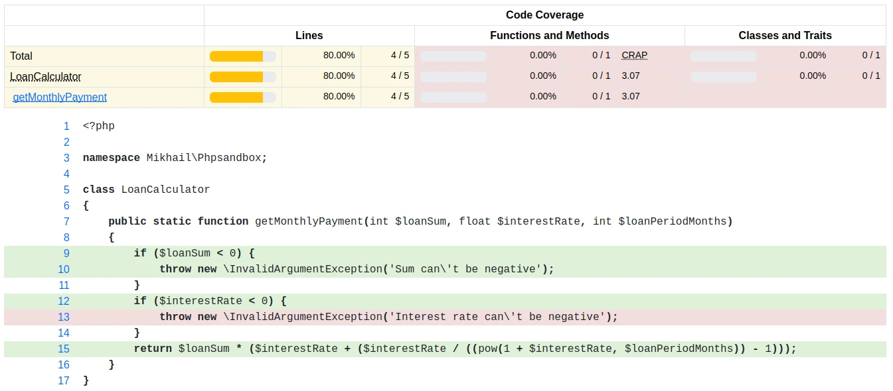

## Введение

В этой статье мы познакомимся с модульным тестированием. Ранее мы уже научились писать модульный код, теперь пришла пора его протестировать. Модульное тестирование по-моему является достаточно важной причиной, почему в принципе стоит писать модульный код. Но что это вообще такое?

Когда мы впервые сталкиваемся необходимостью тестирования, то на ум приходит классический подход: человек берет установленную программу и вручную проходит все возможные сценарии использования. Такой подход тоже нужен, но он трудный и медленный. Количество комбинаций, которые нужно проверить быстро растет и стремится к бесконечности. В итоге программа получается недотестированной, и ошибки находят уже пользователи. 

Даже если каким-то образом удалось максимально точно все проверить, никто не гарантирует, что при следующем релизе не образуются новые ошибки. Когда такое случается, мы называем это регрессией.

## Цели модульного тестирования

Нам необходимо каким-то образом "зафиксировать" состояние программы, чтобы уже решенные проблемы не возникали вновь. Тут и вступают в игру unit-тесты.

Вопреки распространенному мнению, модульные тесты в первую очередь нужны не для проверки граничных значений, а именно для защиты программы от регрессии. Все мы сталкивались с тем, как при выпуске новой версии программы чинят старые баги и добавляют новые. Это удручает как пользователей, так и разработчиков. Никому не охота возвращаться по несколько раз к одной и той же проблеме. Менеджмент ненавидит возвращающиеся к жизни проблеммы, ведь они уже однажды выделили бюджет на их решение.

Ситуацию несколько облегчают модульные тесты. Каждый раз когда мы находим баг, мы пишем на него модульный тест. Более он нас не беспокоит. Конечно, они не являются серебрянной пулей к решению всех проблем. Но по меньшей мере они защищают нас от необходимости снова и снова возвращаться к старым проблемам. Так мы можем сосредоточиться на разработке нового ~~бага~~ функционала, не отвлекаясь на прошлое.

Что именно тестируют модульные тесты? Исходя из названия, можно сказать, что они работают с минимальным модулем программы. В случае ООП, это один класс и его методы. Но мы дадим более строгое определение: тесты являются модульными, когда код не взаимодействует с внешним миром. Один тест может работать как с отдельным методом, так и с агрегатом из множества классов, но при этом не должен взаимодействовать с базой данных, внешним API и пр. Условия теста всегда должны быть зафиксированы (и даже называются fixture) и тесты должны выполняться мгновенно.

## Тесты как требования

Модульные тесты было бы правильно назвать требованиями к ПО. Когда мы пишем тесты для модуля, то перечисляем все, что может случиться с ним в тесте. Приведем пример, следующая функция расчитывает среднюю плотность населения на км<sup>2</sup>:

```c
float population(float areaKm, int population);
```

Решение в данном случае тривиально, но представим, что мы его не знаем. Какие требования можно предъявит к этой функии:

- площадь не может равняться нулю;
- площадь не может быть отрицательным числом;
- население не может быть отрицательным числом;
- если население равняется нулю, то ответом точно будет ноль.

Эти требования показывают, какие тесты мы должны написать. Если в результате работы программы возникло новое требование, мы добавляем к набору тестов еще один. Хорошей метрикой является 1 тест на каждый цикл и условие в коде. Каждая такая конструкция выполняет какое-то требование программы. Значит, это требование должно быть зафиксировано тестом.

## Знакомство с PHPUnit

Далее приведем пример теста. Будем использовать PHP и библиотеку PHPUnit. PHPUnit - часть семейства тестовых фреймворков, которые объединены неофициальным названием xUnit (позже это название приватизировал тестовый фреймворк для C#). Впервые они получили распространение в языке Smalltalk, а популярность обрели с выходом на Java библиотеки JUnit. 

Тестовый фреймворк семейства [xUnit существует практически для любого языка программирования](https://en.wikipedia.org/wiki/List_of_unit_testing_frameworks). Если же его нет, то не составит труда написать [свой собственный](https://github.com/malchikovma/csnake/blob/main/snake_test.c).

Возьмем что-то интереснее, чем деление двух чисел: расчет ежемесячного платежа по кредиту [^1]. Определим его по следующей формуле:

[^1]: Взял первую попавшуюся формулу из сети: [Как рассчитать проценты по кредиту](https://www.raiffeisen.ru/wiki/kak-rasschitat-procenty-po-kreditu/).

$$
x = S \times (P + \dfrac{P}{(1+P)^N})
$$

Здесь S — сумма займа, P — 1/100 доля процентной ставки (в месяц), N — срок кредитования (в месяцах).

Класс будет выглядеть следующим образом (это незаконченная реализация):

```php
class LoanCalculator
{
  public static function getMonthlyPayment(
    int $loanSum,
    float $interestRate,
    int $loanPeriodMonths
  ) {
    if ($loanSum < 0) {
      throw new \InvalidArgumentException(
        'Sum can\'t be negative');
    }
    if ($interestRate < 0) {
      throw new \InvalidArgumentException(
        'Interest rate can\'t be negative');
    }
    return $loanSum * ($interestRate + ($interestRate / 
      ((pow(1 + $interestRate, $loanPeriodMonths)) - 1)));
  }
}
```

Установим PHPUnit, создадим директорию для тестов. Как это сделать, можно узнать на [официальном сайте PHPUnit](https://phpunit.de/index.html). В итоге получим следующую структуру проекта:

```
.
├── composer.json
├── composer.lock
├── src
│   └── LoanCalculator.php
└── test
    └── LoanCalculatorTest.php
```

Убедимся, что все настроили правильно, выполним команду из корня проекта: `php vendor/bin/phpunit test`. Она выполнит все что найдет в директории test.

## Структура теста

Напишем пару тестов и обратим внимание на структуру, она типична. 

```php
class LoanCalculatorTest extends TestCase
{
	// Если сумма кредита равна нулю, то ежемесячный платеж,
	// очевидно, тоже равен нулю.
	public function testIfSumZero_resultZero()
	{
		$loanSum = 0;
		$interestRate = 0.1;
		$loanPeriodMonths = 12;

		$result = LoanCalculator::getMonthlyPayment(
			$loanSum,
			$interestRate,
			$loanPeriodMonths
		);

		self::assertEquals(0, $result);
	}

	// Сумма кредита не может быть отрицательной.
	// Бросаем исключение.
	public function testIfSumNegative_throwExp()
	{
		$loanSum = -1;
		$interestRate = 0.1;
		$loanPeriodMonths = 12;

		self::expectException(\InvalidArgumentException::class);

		LoanCalculator::getMonthlyPayment(
			$loanSum,
			$interestRate,
			$loanPeriodMonths
		);
	}
}
```

Каждый тест проверяет только одно требование (максимум 2) и выглядит следующим образом:

1. Задаем условия;
2. Выполняем действие;
3. Проверяем результат.

Если тест начинает проверять множество условий, то стоит задуматься о том, чтобы разделить его.

Первый тест в точности придерживается этой структуры. Второй делает это неявно: мы не можем заявить, что ждем исключение после того как его получили.

Структура теста также может изменяться при использовании тестовых двойников. Это обширная тема, не будем рассматривать ее здесь. Отметим только, что можно использовать двойники, созданные тестовым фреймворком ([тестовые двойники на русском](https://phpunit-documentation-russian.readthedocs.io/ru/latest/test-doubles.html)), а можно использовать созданные вручную. Я использую оба способа, но предпочитаю последний.

## Тестовое покрытие

Самое простое, что мы можем выяснить из нашего набора тестов, это тестовое покрытие (или просто покрытие, coverage). Эта метрика показывает, какое количество строк, классов и методов покрыто тестами. Хорошим показателем для большой кодовой базы является показатель более 85% покрытых строк.

Давайте создадим отчет о покрытии для нашего кода. Для этого нам понадобится расширение [xdebug](https://xdebug.org/docs/install).

Для создания текстового отчета выполним команду:

```sh
XDEBUG_MODE=coverage php vendor/bin/phpunit --coverage-text \
--coverage-filter src test
```

Отчет говорит о том, что покрыто 80% строк. Все верно, мы не написали тест для условия `$interestRate < 0`.

Для наглядности создадим отчет в формате HTML:

```sh
XDEBUG_MODE=coverage php vendor/bin/phpunit --coverage-html \
test/coverage --coverage-filter src test
```



Из отчета о покрытии мы можем узнать какие участки кода пропустили в тестах и наверстать их.

## Заключение

В этой статье мы познакомились с основами модульного тестирования. Можно многое прочитать по этой теме, но я заметил, что лучшим учителем здесь является практика.

Мы пропустили множество тем касающихся PHPUnit, с ними можно ознакомиться в [документации](https://phpunit-documentation-russian.readthedocs.io/ru/latest/). На русском она слегка устарела, но принципы остались прежними.

Модульное тестирование - это навык. Изучив его однажды, можно использовать в разных языках и фреймворках. Оно обрело популярность в 1997 году, с выходом jUnit, и с тех пор только набирало обороты. Несомненно, такой навык стоит приобрести.

