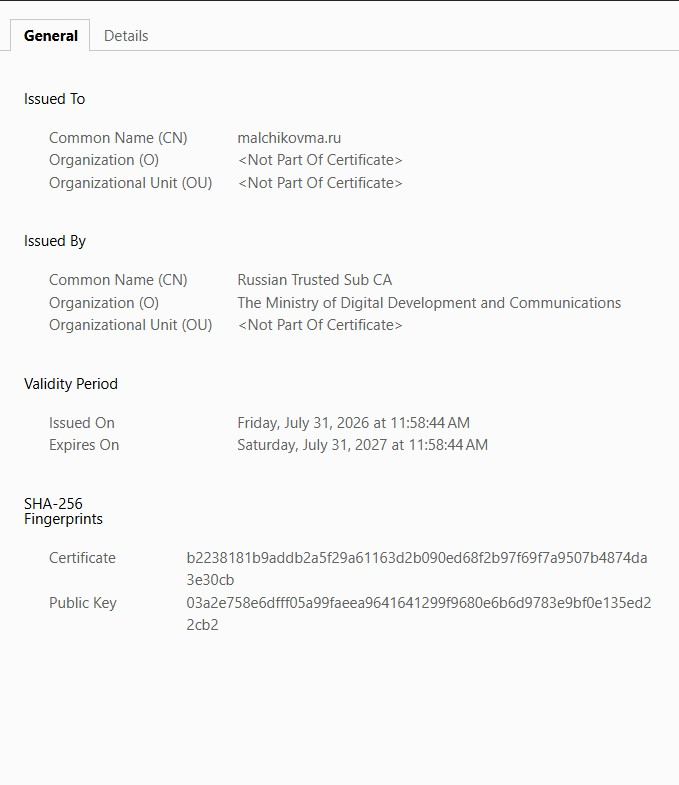

## Введение

Однажды вечером я размышлял о цифровых угрозах в условиях текущей экономической блокады. Закрывают доступ ко всему подряд, и я задумался: а могут ли заблокировать Let's Encrypt? У нас в компании на нём тысяча доменов. Даже vk.ru сейчас на Let's Encrypt. Последние новости только подкрепили мои опасения: [GlobalSign отозвал часть сертификатов](https://habr.com/ru/news/1047084/). И какие альтернативы предоставляет нам вселенная? У нас же есть система сертификатов Минцифры.

Вечер был томным, всё нужное было под рукой, и я решил получить российские сертификаты для своего сайта. Сначала написал инструкцию для себя, а потом решил поделиться со всеми.

Получать сертификаты будем через Госуслуги — других вариантов я не нашёл. Я делал конфиг для своего сайта, вам, конечно же, нужно подставить свои данные. Часть команд я выполнял в Windows 11 PowerShell, часть — в WSL (Ubuntu) bash.

## Виды сертификатов

Госуслуги выдают два вида сертификатов: OV (Organization Validation) и DV (Domain Validation).

> Характеристики OV-сертификата:
> - Подтверждает, что вы владеете и управляете указанным в сертификате доменом, а передача данных пользователей защищена
> - Защищает несколько доменов
> - Действует 365 дней с даты выдачи
> - Доступен гражданам РФ, организациям и ИП
>
> Характеристики DV-сертификата:
> - Подтверждает, что вы управляете указанным в сертификате доменом, а передача данных пользователей защищена
> - Защищает один домен
> - Действует 90 дней с даты выдачи
> - Доступен гражданам РФ, иностранцам, организациям и ИП

В природе существует ещё и EV (Extended Validation), но это уже другая история.

## Госуслуги

Вот такой диалог состоялся у меня с Роботом Максом в строке поиска:

> Я: SSL-сертификат
>
> Робот Макс: Уточните свою роль при использовании сертификата безопасности
>
> Я: Владелец сайта
>
> Робот Макс: Вот что я могу предложить по сертификату безопасности для владельца сайта...
>
> Я: Получение и виды сертификатов
>
> Робот Макс: На Госуслугах можно получить сертификаты безопасности OV и DV с алгоритмом шифрования RSA или ГОСТ. Понадобится подтверждённая учётная запись
>
> Различия сертификатов OV и DV (открывается модальное окно)
>
> Как получить на Госуслугах
> - Подайте заявление на получение OV-сертификата. Сертификат в форматах cer и crt придёт в течение 3 рабочих дней в личный кабинет
> - Подайте заявление на получение DV-сертификата. Сертификат в форматах cer и crt придёт в течение 1 рабочего дня в личный кабинет
>
> Услуга бесплатная

Далее на выбор дают два варианта: RSA и ГОСТ. Я посчитал, что использование сертификатов Минцифры уже достаточно патриотично, поэтому выбрал RSA.

Ссылка на официальную инструкцию: [Создание гражданином запроса на выпуск OV-сертификата с алгоритмом шифрования RSA](https://gu-st.ru/content/PDF/Instrukciya_RSA_OV_FL.pdf).

## CSR (Certificate Signing Request)

Создаём файл `malchikovma.ru.conf`, заполняем по образцу секции `req_distinguished_name` и `subjectAltName`. Я заказывал сертификат сразу для основного домена и его поддоменов, поэтому в `subjectAltName` указал сразу две записи.

```ini
openssl_conf = openssl_init

[ openssl_init ]
stbl_section = stable_section

[ req ]
distinguished_name = req_distinguished_name
req_extensions = v3_req
x509_extensions = v3_req
prompt = no
string_mask = utf8only
utf8 = yes

[ req_distinguished_name ]
CN = malchikovma.ru
SN = Мальчиков
GN = Михаил Александрович
C = RU
SNILS = 12345678901
INN = 123456789012

[ v3_req ]
keyUsage = digitalSignature, keyEncipherment, keyAgreement
extendedKeyUsage = serverAuth, clientAuth
subjectAltName = DNS:malchikovma.ru, DNS:*.malchikovma.ru

[ stable_section ]
SNILS = min:11,max:11,mask:NUMERICSTRING,flags:nomask
INN = min:12,max:12,mask:NUMERICSTRING,flags:nomask
```

Что интересно, в зарубежных примерах обычно указывают параметры "ST = California, L = San Francisco, O = My Company Inc", а у нас, по классике, нужно указать СНИЛС и ИНН.

Сгенерировать CSR (Certificate Signing Request) на основе конфига:

```sh
openssl req -out malchikovma.ru.csr -new -newkey rsa:2048 -nodes -keyout privkey.pem -config malchikovma.ru.conf
```

На выходе получим файлы `malchikovma.ru.csr` и `privkey.pem`.

Проверить валидность:

```sh
openssl req -in malchikovma.ru.csr -noout -text -nameopt utf8 -config malchikovma.ru.conf
```

## Регистратор доменных имен

Далее, нужно подтвердить, что мы владеем доменом. Подтверждение через DNS или файл на сервере? Это все - прошлый век. Идем к своему регистратору имен (у меня это - рег.ру.), покупаем свидетельство о регистрации домена. На момент написания стоимость - 203 рубля.

Далее нам понадобится <abbr title="усиленная квалифицированная электронная подпись">УКЭП</abbr>, мы же делаем OV-сертификат. Как у организации, у нас конечно же, должна быть УКЭП. Если у нас ее нет, то ищем удостоверяющий центр поблизости, бронируем время и идем покупать токен примерно за 3 т.р. Я покупал у Тензора, просто потому, что он ближе.

Теперь нужно подписать файл `malchikovma.ru.conf` и свидетельство о регистрации домена, т.е. создать файлы `.sig` с помощью УКЭП из любой сторонней программы. Если у вас оплачен КриптоПРО, то можно им, лично я использовал КриптоАРМ.

## Снова Госуслуги, DNS

Отправляем все это на госуслуги. Нас просят подтвердить владение доменом еще через DNS (официального документа с подписью недостаточно). Добавляем требуемую TXT запись. Госуслуги требуют по 1 TXT записи на каждый домен, но меня пропустил с 1 записью. Идем спать. На следующий день получаем сертификаты.

Что имеем в архиве?

- certificate.cer
- certificate.cer.sig
- certificate.crt
- certificate.crt.sig

Файлы `.sig` - это подписи, нас сейчас не интересуют. Мы имеем два сертификата, `certificate.cer` и `certificate.crt`. Сравнение показывает, что это одинаковые файлы. Зачем? Непонятно.

## Подготовка сертификатов

Сертификаты нам предоставляют в бинарном виде (<abbr title="Distinguished Encoding Rules">DER</abbr>), а веб-серверу нужны в текстовом (<abbr title="Privacy-Enhanced Mail">PEM</abbr>). Преобразуем DER в PEM:

```sh
openssl x509 -inform der -in certificate.crt -out malchikovma.ru.crt
```

На выходе получаем файл `malchikovma.ru.crt`.

Но это конечные сертификаты, а для HTTPS нам нужна полная цепочка. Скачиваем корневой и промежуточный (выпускающий) сертификат Минцифры. Находим среди них те, что в текстовом формате. Официальная страница российских сертификатов на Госуслугах.

Объединить сертификаты в цепочку:

```sh
cat gosuslugi-malchikovma.ru/malchikovma.ru.crt \
russian_trusted_sub_ca_pem/russian_trusted_sub_ca_pem.crt \
linux_russian_trusted_root_ca_pem/russian_trusted_root_ca_pem.crt > fullchain.crt
```

Загружаем цепочку сертификатов и приватный ключ, созданный на первом шаге, на сервер. Еще я переименовал crt в pem, чтобы сразу понимать формат.

```sh
# /etc/ssl/mincifry/malchikovma.ru
ls -la
# drwxr-xr-x 2 root root 4096 Jul 31 12:17 .
# drwxr-xr-x 3 root root 4096 Jul 31 12:15 ..
# -rw-r--r-- 1 root root 7592 Jul 31 12:17 fullchain.pem
# -rw------- 1 root root 1704 Jul 31 12:17 privkey.pem
```

## Веб-сервер

Указываем на веб-сервере, какие нужно использовать сертификаты. У меня это Nginx:

```nginx
server {
    listen 443 ssl;
    listen [::]:443 ssl;
    server_name malchikovma.ru www.malchikovma.ru;

    ssl_certificate /etc/ssl/mincifry/malchikovma.ru/fullchain.pem;
    ssl_certificate_key /etc/ssl/mincifry/malchikovma.ru/privkey.pem;

    # Рекомендуемые базовые настройки безопасности SSL
    ssl_protocols TLSv1.2 TLSv1.3;
    ssl_prefer_server_ciphers on;
    ssl_ciphers HIGH:!aNULL:!MD5;
}
```

Перезагружаем его. Сайт теперь открывается по HTTPS.



## Заключение

После этой незамысловатой процедуры, следующие 365 дней наш сайт будет доступен по HTTPS. А сертификаты подтверждены самим Министерством цифрового развития, связи и массовых коммуникаций Россиийской Федерфции. Но это при условии, что у вас на компьютере установлены их корневые сертификаты. Не будем здесь рассуждать, их наличие - это хорошо или плохо. На хабре в последнее время и так полно постов на эту тему. Мне же, как ИП с УКЭП, они необходимы. А еще, на днях без них перестал открываться Сбербанк. Мы же с вами прошли путем исследователя, которому интересно, как устроен процесс получения.

А теперь серьезно. Этот процесс ужасно медленный и трудоемкий. Сертификат Let's Encrypt можно получить за пару минут и несколько команд в терминале. Да, я получал OV сертификат, это чуть более ответственная вещь, чем DV. Но для DV сертификата похожая история. Если кто-то из Минцифры читает это, пожалуйста, сделайте инструменты для автоматизации. ACME протокол это позволяет.